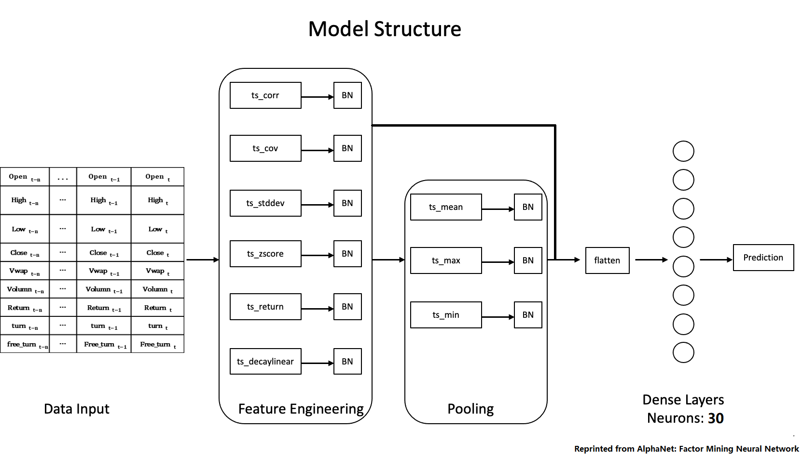
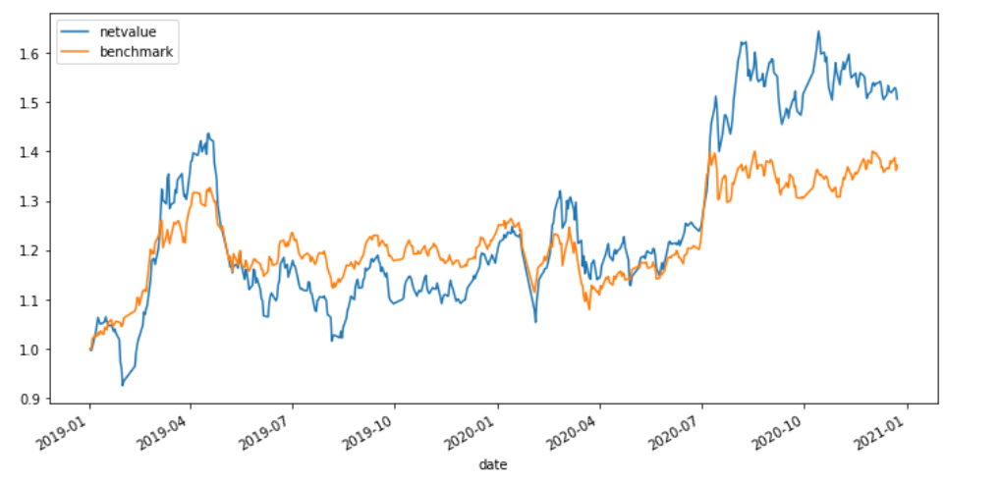

# Quantitative Trading via Machine Learning in the Chinese Stock Market

## —— Course Final Project

### Machine Learning for Finance (FN 570) 2021-22 Module 1 (Fall 2021)

*author: Bo Sun, Xinran Guo*

* Jupyter notebook: [MLF Final Project](MLF_Final_Project.ipynb)
  
* Full data: [BaiduYun Disk]("https://pan.baidu.com/s/1mPXVN1QF_gMfMrLIMUSLOg") (extraction code: `jxee`)
  
* Reference research paper: [Huatai paper](reference/华泰人工智能系列三十二：alphanet：因子挖掘神经网络_2020-06-15_华泰证券.pdf)

------


### 1. Introduction

Using deep learning modle to extract features directly from raw data and make predictions in an end to end manner becomes more and more polular. In this project, we implement a kind of network structure in the research report mentioned above, directly extract the features in the quantity and price data, and the generated factors have a good performance. Basically, we stack the data together to form the data matrix which we call data picture in the following part, and apply two-dimensional Convolutional Neural Network (2d-CNN) to extract important feature from data picture. We train our model with historical stock data and conduct backtesting on rolling basis (see Figure 1). 


### 2. Data collection

PHBS has a Oracle database for A share stock price, we get our data from here. Here is our data collection processing. 

- First we read from database.ini containing info of the database and use keys.
- Second we write queries to read data from Oracle database month by month (since there is a limit for query data size)
- Third we concatenate monthly data and save it as a parquet file.

*We save the data as parquet file and  everybody should be able to load the data from parquet file conveniently.* 

#### 2.1 Extra Collection

1. First is the ST stocks, where ST stands for "Special Treatment". The Shanghai and Shenzhen Stock Exchange conduct special treatment on the stock transactions of listed companies with abnormal financial conditions or other conditions, and prefix them with "ST" in front of the abbreviation, so such stocks are called ST stocks. We will exclude ST stocks from our portfolio because they are highly illiquid and facing great delisting risks, so we need to read them from database.
2. Next, we also need information on the listing and delisting date of stocks. China’s A-shares have a price limit system, and newly listed stocks will have consecutive up-limits for a period of time and cannot be traded. Based on the above reason, we also exclude stocks that have been listed for less than 120 days from our portfolio.

#### 2.2 Data Integration

1. merge all data into one single DataFrame
2. create a "isst" column indicating whether a stock is in Special Treatment
3. create a "istrade" column indicating whether a stock is traded on that day
4. create a "isnew" column indicating whether a stock has been traded for at least 120 days
5. drop additional columns ,convert date string to datetime type and fill nan columns
6. save the data as a parquet file

#### 2.3 Benchmark

We choose The Shanghai Securities Composite Index (000001.SH) as our benchmark. Its sample stocks are all stocks listed on the Shanghai Stock Exchange, including A shares and B shares, reflecting the changes in the prices of listed stocks on the Shanghai Stock Exchange. It was officially released on July 15, 1991.

*we also read the index data from PHBS database and save it as 'marketindex.parquet' file.*

### 3. Data Processing

In order to use CNN model, we need to convert our data to "data pictures" that serve as training and predicting inputs. Our data pictures take the following format:

**Stock universe :** All Chinese A-share main board stocks, excluding newly-listed stocks, ST and PT stocks, and all stocks that are suspended or hit price limits in the following trading day.

**Time span :** Starting from 2011, we use past 500 trade days data as training period input.

**Variables :**

- return: daily return
- open, high, low, close: daily open price, highest price, lowest price, and close price
- volume: daily trading volume
- vwap: daily volume weighted average price
- turn: daily turnover rate
- free_turn: daily turnover rate of free float shares

**Input shape :** 9*30

**Labels :** standardized returns in the next two weeks (10 days)

*Here is what our data pictures look like:*


*Here is what our sample data pictures look like:*

```
Sample data picture: 
 [[ 1.48000000e+01  1.53000000e+01  1.52200000e+01  1.59000000e+01
   1.60400000e+01  1.62000000e+01  1.65600000e+01  1.73000000e+01
   1.74800000e+01  1.76400000e+01  1.79400000e+01  1.75300000e+01
   1.82000000e+01  1.80000000e+01  1.77600000e+01  1.75400000e+01
   1.77400000e+01  1.76500000e+01  1.77100000e+01  1.83500000e+01
   1.83700000e+01  1.77100000e+01  1.76700000e+01  1.80000000e+01
   1.82000000e+01  1.78100000e+01  1.74200000e+01  1.70800000e+01
   1.73800000e+01  1.77800000e+01]
 [ 1.52700000e+01  1.55500000e+01  1.60500000e+01  1.61100000e+01
   1.61200000e+01  1.69200000e+01  1.73700000e+01  1.81000000e+01
   1.76000000e+01  1.80000000e+01  1.85000000e+01  1.87800000e+01
   1.82900000e+01  1.80000000e+01  1.79000000e+01  1.79300000e+01
   1.83600000e+01  1.80500000e+01  1.83400000e+01  1.84800000e+01
   1.85000000e+01  1.77500000e+01  1.80000000e+01  1.85000000e+01
   1.83000000e+01  1.79400000e+01  1.74700000e+01  1.74300000e+01
   1.79300000e+01  1.85000000e+01]
 [ 1.48000000e+01  1.51300000e+01  1.52100000e+01  1.57700000e+01
   1.58000000e+01  1.61500000e+01  1.65400000e+01  1.73000000e+01
   1.72500000e+01  1.73300000e+01  1.73000000e+01  1.75300000e+01
   1.74500000e+01  1.75000000e+01  1.72900000e+01  1.73500000e+01
   1.76000000e+01  1.73300000e+01  1.77000000e+01  1.79600000e+01
   1.75400000e+01  1.72200000e+01  1.75400000e+01  1.79300000e+01
   1.76000000e+01  1.74500000e+01  1.66900000e+01  1.69000000e+01
   1.72500000e+01  1.77500000e+01]
 [ 1.51700000e+01  1.51800000e+01  1.59000000e+01  1.60600000e+01
   1.60300000e+01  1.65600000e+01  1.71000000e+01  1.74800000e+01
   1.75400000e+01  1.79100000e+01  1.75600000e+01  1.81300000e+01
   1.77000000e+01  1.77600000e+01  1.76300000e+01  1.77700000e+01
   1.77500000e+01  1.76300000e+01  1.79600000e+01  1.83200000e+01
   1.77000000e+01  1.76400000e+01  1.78400000e+01  1.81100000e+01
   1.78100000e+01  1.76600000e+01  1.71800000e+01  1.73700000e+01
   1.78300000e+01  1.84600000e+01]
 [ 1.51064000e+01  1.52927000e+01  1.57665000e+01  1.59986000e+01
   1.59674000e+01  1.65892000e+01  1.71273000e+01  1.77140000e+01
   1.74276000e+01  1.77094000e+01  1.76780000e+01  1.82845000e+01
   1.77425000e+01  1.77728000e+01  1.76278000e+01  1.76947000e+01
   1.79903000e+01  1.75821000e+01  1.80347000e+01  1.82411000e+01
   1.78987000e+01  1.75132000e+01  1.77503000e+01  1.81589000e+01
   1.78466000e+01  1.76784000e+01  1.69990000e+01  1.72163000e+01
   1.76979000e+01  1.82658000e+01]
 [ 1.21706482e+06  9.00425930e+05  1.59134715e+06  9.08819480e+05
   6.62562360e+05  1.60006232e+06  2.09561419e+06  2.01610552e+06
   9.60071950e+05  1.24456018e+06  1.89051905e+06  1.69850168e+06
   1.17559865e+06  1.03486504e+06  1.20582386e+06  8.46603620e+05
   1.00780383e+06  9.68452770e+05  9.57868630e+05  1.24763640e+06
   1.42946944e+06  8.48781530e+05  9.51424320e+05  1.02106281e+06
   9.40130070e+05  6.77258480e+05  1.28918923e+06  7.59856930e+05
   8.52930510e+05  1.37340072e+06]
 [ 2.50000000e+00  6.59000000e-02  4.74310000e+00  1.00630000e+00
  -1.86800000e-01  3.30630000e+00  3.26090000e+00  2.22220000e+00
   3.43200000e-01  2.10950000e+00 -1.95420000e+00  3.24600000e+00
  -2.37180000e+00  3.39000000e-01 -7.32000000e-01  7.94100000e-01
  -1.12500000e-01 -6.76100000e-01  1.87180000e+00  2.00450000e+00
  -3.38430000e+00 -3.39000000e-01  1.13380000e+00  1.51350000e+00
  -1.65650000e+00 -8.42200000e-01 -2.71800000e+00  1.10590000e+00
   2.64820000e+00  3.53340000e+00]
 [ 6.27200000e-01  4.64000000e-01  8.20000000e-01  4.68300000e-01
   3.41400000e-01  8.24500000e-01  1.07990000e+00  1.03890000e+00
   4.94700000e-01  6.41300000e-01  9.74200000e-01  8.75300000e-01
   6.05800000e-01  5.33300000e-01  6.21400000e-01  4.36300000e-01
   5.19300000e-01  4.99100000e-01  4.93600000e-01  6.42900000e-01
   7.36600000e-01  4.37400000e-01  4.90300000e-01  5.26200000e-01
   4.84500000e-01  3.49000000e-01  6.64300000e-01  3.91600000e-01
   4.39500000e-01  7.07700000e-01]
 [ 1.41500000e+00  1.04690000e+00  1.85020000e+00  1.05660000e+00
   7.70300000e-01  1.86030000e+00  2.43640000e+00  2.34400000e+00
   1.11620000e+00  1.44700000e+00  2.19800000e+00  1.97470000e+00
   1.36680000e+00  1.20320000e+00  1.40190000e+00  9.84300000e-01
   1.17170000e+00  1.12600000e+00  1.11370000e+00  1.45060000e+00
   1.66200000e+00  9.86800000e-01  1.10620000e+00  1.18710000e+00
   1.09300000e+00  7.87400000e-01  1.49890000e+00  8.83400000e-01
   9.91700000e-01  1.59680000e+00]]
```

### 4. Feature Engineering

#### 4.1 CNN

It is assumed that the past trading information indicates future return. The two-dimensional feature of CNN is desirable for this task because data pictures contain different kinds of variables and their time variation. However, CNN was originally designed to extract image information, which means CNN only focus on the partial  information of adjacent data points in our data pictures. So we've made some improvements here, we try different combinations of different rows of the data picture, and apply different functions to those combinations. Fianlly we get a collection of new data pictures derived from the different functions.  Here is the list of custom functions (Table 1).

*Table 1. List of Functions and Their Description*

| Function       | Description                                                  |  Mapping Example   |
| -------------- | :----------------------------------------------------------- | :----------------: |
| ts_corr        | compute the correlations between rows                        | (n,9,30)->(n,36,3) |
| ts_cov         | compute the covariance between rows                          | (n,9,30)->(n,36,3) |
| ts_mean        | compute the mean of blocks in each row                       | (n,9,30)->(n,9,3)  |
| ts_stddev      | compute the standard deviation of blocks in each row         | (n,9,30)->(n,9,3)  |
| ts_zscore      | compute the zscore (mean over std.dev.) of blocks in each row | (n,9,30)->(n,9,3)  |
| ts_return      | compute the return of blocks in each row                     | (n,9,30)->(n,9,3)  |
| ts_decaylinear | compute the weighted average (with decaying weights) of blocks in each row | (n,9,30)->(n,9,3)  |

The functions in Table 1 can be divided into two types. 

* The first type measures the relationship between rows. eg(ts_corr, ts_cov...)
*  The second type computes the statistics of each rows. eg(ts_mean, ts_stddev...)

Suppose we set stride (parameter in CNN) to be equal to 5.

1. The Figure 3 shows how the first type functions work. The function will slide between different rows which include adjacent rows and seperated rows to calculate the statistics like correlations and covariance (the number of rows of new data pictures becomes 36). 
2. The Figure 4 shows how the first type functions work. The function will just slide across one row and calculate the statistics like mean and standard deviation (the number of rows of new data pictures is ​still 9).


#### 4.2 Batch Normalization

standardize data

#### 4.3 Pipeline Structure

Here we combine CNN processing and Batch Normalization into Pipeline struction (Figure 5), we can see that each function generate a new data picture as our output. 


### 5. Neural Network Architecture

#### 5.1 Pooling Layer

*Table 2. List of Pooling Functions and Their Description*

| Function | Description                            | Mapping Example |
| -------- | -------------------------------------- | --------------- |
| mean     | compute the mean of blocks in each row | (n,k,3)->(n,k)  |
| max      | compute the max of blocks in each row  | (n,k,3)->(n,k)  |
| min      | compute the min of blocks in each row  | (n,k,3)->(n,k)  |

#### 5.2 Model Structure

The network architecture is feature input layers + fully connected dense layer. The model structure of our CNN Model is shown below. 

After feature engineering layers, we will flatten all features, disgarding the temporal information. 

The flattened features are then fed into a dense layer with 30 units. The number of neurons in the hidden layer is not restrained, we will use the same setting as the *Huatai Report*.



#### 5.3 Model Setting

**Training Configuration**

* activation function for the dense layer is the linear rectified unit (ReLU), whose derivative is easy to compute.

* optimizer is a SGD algorithm called Adam, which is an extended version of SGD proposed by Kingma and Ba (2017).

* learning rate is 0.002

**Regularization**

Neural networks are extremely easy to overfit and regularization is indispensable.

We use three regularization methods from the literature to mitigate overfitting 

1. Early Stopping

   Early stopping is that we examine model performances on the validation set and stop training whenever we observe that model performances on the validation set stop improving. Typically, models will stop improving on the validation set earlier than on the training set, so it is named "Early Stopping".

2. Batch Normalization

   The rationale behind batch normalization is that Adam randomly selects a batch of observations and only uses that batch of data for gradient updating in every optimization round, because computing gradients for all observations is costly and unnecessary. Hence, sample draws may have heterogeneous distributions. In order to sterilize the impact of heterogeneous random draws, we normalize the random batch after the input layer and between each fully connected hidden layer. The specific operations are to first subtract the mean and then divide the square root of batch variance.

3. Dropout

   Dropout is a technique that literally “drop out” a certain portion of neurons. Dropout is a potent regularization method and has proved its value in computer vision. This can prevent the networks from getting too convoluted by randomly setting a specific proportion of neurons in each layer to 0. The dropout rate in the hidden layer is 50%. It needs to be particularly emphasized that we enlarge the number of neurons accordingly. we adjust the number of neurons to be the original neuron number dividing the dropout rate. For example, if the dropout rate is 50% and the original number of neurons is 15, then the new number of neurons is 15/0.5 = 30.

### 6. Backtesting

#### 6.1 Baseline Model

In order to compare the performance of our model, we first constructs a baseline model using NN with 2 hiden layers.

**Structure**

- The first hidden layer consists of:
  - 30 neurons
  - ReLU activation function
  - 50% dropout
- The second hidden layer consists of:
  - 10 neurons
  - ReLU activation function
  - 50% dropout
- The output layer consists of:
  - 1 neurons
  - linear activation function

**Backtest Engine**

- **Initialize functions** : set parameters and load market data
  - we use VWAP as our trading price,
  - market price is adjusted for stock and cash dividends
- **Selecting function** : calculate target portfolio on a given trade day
  - we only select stocks that are tradable, not ST, not up-limit and not newly listed
- **Backtest function** : calculate portfolio netvalue and benchmark value
- **Evaluation function and plot function** : display the result
  - evaluation is displayed in a monthly basis
  - plot function plots the portfolio as well as benchmark

**Baseline Performace**

It can be observed from the following results that the baseline model perform just as good as our benchmark index 000001.SH.


|    | yearMonth   |      return |   annualReturn |   maxDrawDown |    Sharpe |   winRate |   excessReturn |   annualExcessReturn |
|---:|:------------|------------:|---------------:|--------------:|----------:|----------:|---------------:|---------------------:|
|  0 | 201901      | -0.0742386  |     -0.890863  |    -0.131091  | -3.4875   |  0.318182 |    -0.122623   |           -1.47147   |
|  1 | 201902      |  0.279067   |      3.3488    |    -0.0047634 | 17.9296   |  0.533333 |     0.135285   |            1.62343   |
|  2 | 201903      |  0.10134    |      1.21608   |    -0.0515871 |  3.37452  |  0.571429 |     0.0973387  |            1.16806   |
|  3 | 201904      | -0.0491878  |     -0.590253  |    -0.137591  | -1.84286  |  0.52381  |    -0.0746173  |           -0.895408  |
|  4 | 201905      | -0.0773329  |     -0.927995  |    -0.0629509 | -3.53555  |  0.5      |    -0.0357765  |           -0.429318  |
|  5 | 201906      |  0.00198715 |      0.0238458 |    -0.0497665 |  0.130318 |  0.473684 |    -0.0117217  |           -0.140661  |
|  6 | 201907      | -0.0384726  |     -0.461671  |    -0.0876044 | -2.17537  |  0.434783 |    -0.0256677  |           -0.308012  |
|  7 | 201908      |  0.0196582  |      0.235898  |    -0.075042  |  0.902594 |  0.681818 |     0.0372148  |            0.446578  |
|  8 | 201909      | -0.0281184  |     -0.337421  |    -0.0827167 | -2.021    |  0.45     |    -0.0268494  |           -0.322192  |
|  9 | 201910      |  0.021537   |      0.258444  |    -0.0347154 |  1.58957  |  0.5      |     0.00935969 |            0.112316  |
| 10 | 201911      | -0.0204713  |     -0.245656  |    -0.0409711 | -1.53282  |  0.619048 |     0.0164737  |            0.197684  |
| 11 | 201912      |  0.0880032  |      1.05604   |    -0.0200639 |  7.29189  |  0.590909 |     0.0204775  |            0.24573   |
| 12 | 202001      |  0.0076166  |      0.0913992 |    -0.0407249 |  0.72692  |  0.625    |     0.0325696  |            0.390835  |
| 13 | 202002      |  0.0397662  |      0.477194  |    -0.0572286 |  1.20498  |  0.6      |     0.116726   |            1.40071   |
| 14 | 202003      | -0.0812219  |     -0.974663  |    -0.128062  | -2.54835  |  0.545455 |    -0.0247658  |           -0.29719   |
| 15 | 202004      |  0.00214148 |      0.0256978 |    -0.0805939 |  0.119632 |  0.47619  |    -0.0461719  |           -0.554062  |
| 16 | 202005      |  0.0231046  |      0.277255  |    -0.0468056 |  1.83811  |  0.555556 |     0.01918    |            0.23016   |
| 17 | 202006      |  0.060826   |      0.729912  |    -0.0143051 |  5.35352  |  0.4      |     0.0132564  |            0.159077  |
| 18 | 202007      |  0.224845   |      2.69814   |    -0.0738728 |  7.6286   |  0.608696 |     0.156486   |            1.87783   |
| 19 | 202008      |  0.037602   |      0.451224  |    -0.0555603 |  1.76092  |  0.52381  |    -0.0131245  |           -0.157494  |
| 20 | 202009      | -0.0406642  |     -0.48797   |    -0.0836339 | -2.42755  |  0.545455 |     0.011669   |            0.140028  |
| 21 | 202010      |  0.029766   |      0.357192  |    -0.0849082 |  1.7056   |  0.625    |     0.0163064  |            0.195677  |
| 22 | 202011      | -0.0251234  |     -0.301481  |    -0.0559316 | -1.84565  |  0.380952 |    -0.065724   |           -0.788687  |
| 23 | 202012      | -0.0104235  |     -0.125082  |    -0.0240164 | -1.57527  |  0.588235 |    -0.00183029 |           -0.0219634 |
| 24 | Total       |  0.508001   |      0.254001  |    -0.293088  |  0.872737 |  0.525988 |     0.136025   |            0.0680127 |


#### 6.2 CNN Model

We build out CNN model follow the steps above.

**Structure**

- The first hidden layer consists of:
  - Feature Engineering Layer
- The second hidden layer consists of:
  - Batch Normalization Layer
- The third layer consists of:
  - Pooling Layer
- The fourth hidden layer consists of:
  - Batch Normalization Layer
- we flatten the output of the second and the fourth layer as the input of the dense layer
- The dense layer consists of:
  - 90 neurons
  - ReLU activation function
  - 50% dropout
- The output layer consists of:
  - 1 neurons
  - linear activation function

**CNN Performance**


|    | yearMonth   |      return |   annualReturn |   maxDrawDown |    Sharpe |   winRate |   excessReturn |   annualExcessReturn |
|---:|:------------|------------:|---------------:|--------------:|----------:|----------:|---------------:|---------------------:|
|  0 | 201901      |  0.0545571  |      0.654685  |   -0.0230795  |  4.07283  |  0.590909 |     0.0061728  |            0.0740735 |
|  1 | 201902      |  0.179923   |      2.15907   |   -0.0177695  | 10.1387   |  0.533333 |     0.0504047  |            0.604856  |
|  2 | 201903      |  0.0511456  |      0.613747  |   -0.0332866  |  2.53818  |  0.47619  |     0.0196133  |            0.235359  |
|  3 | 201904      |  0.0193181  |      0.231817  |   -0.0790376  |  0.992358 |  0.47619  |     0.0131236  |            0.157484  |
|  4 | 201905      | -0.0612428  |     -0.734914  |   -0.0359572  | -3.07989  |  0.55     |    -0.00505835 |           -0.0607002 |
|  5 | 201906      |  0.0152738  |      0.183286  |   -0.0355278  |  0.875262 |  0.368421 |    -0.0049591  |           -0.0595092 |
|  6 | 201907      | -0.037348   |     -0.448176  |   -0.0736488  | -2.3403   |  0.391304 |    -0.0228833  |           -0.2746    |
|  7 | 201908      | -0.0208184  |     -0.249821  |   -0.0729416  | -1.12545  |  0.590909 |    -0.00648709 |           -0.0778451 |
|  8 | 201909      |  0.0107082  |      0.128498  |   -0.059941   |  0.729901 |  0.5      |     0.0161963  |            0.194356  |
|  9 | 201910      |  0.0273293  |      0.327952  |   -0.0320775  |  2.14403  |  0.666667 |     0.0211412  |            0.253694  |
| 10 | 201911      | -0.0292639  |     -0.351167  |   -0.0458942  | -3.23921  |  0.47619  |     0.00148862 |            0.0178634 |
| 11 | 201912      |  0.0730831  |      0.876997  |   -0.0274273  |  5.40346  |  0.636364 |     0.0072652  |            0.0871824 |
| 12 | 202001      |  0.0202175  |      0.24261   |   -0.0561247  |  1.59927  |  0.625    |     0.043493   |            0.521916  |
| 13 | 202002      |  0.00688722 |      0.0826466 |   -0.0436757  |  0.362042 |  0.6      |     0.0799853  |            0.959823  |
| 14 | 202003      | -0.0206202  |     -0.247443  |   -0.131269   | -0.497055 |  0.545455 |     0.037257   |            0.447084  |
| 15 | 202004      |  0.00391376 |      0.0469652 |   -0.0573958  |  0.204208 |  0.428571 |    -0.0333496  |           -0.400195  |
| 16 | 202005      |  0.0308557  |      0.370269  |   -0.0289921  |  3.42791  |  0.611111 |     0.0293435  |            0.352122  |
| 17 | 202006      |  0.0717512  |      0.861014  |   -0.015865   |  6.83452  |  0.45     |     0.0348857  |            0.418629  |
| 18 | 202007      |  0.16211    |      1.94532   |   -0.0610011  |  6.04513  |  0.434783 |     0.0874109  |            1.04893   |
| 19 | 202008      |  0.0479522  |      0.575426  |   -0.039545   |  2.44128  |  0.428571 |     0.00827063 |            0.0992475 |
| 20 | 202009      | -0.0469607  |     -0.563528  |   -0.0710694  | -3.03594  |  0.545455 |     0.00552557 |            0.0663068 |
| 21 | 202010      |  0.020038   |      0.240456  |   -0.0669596  |  1.48247  |  0.625    |     0.00588076 |            0.0705691 |
| 22 | 202011      | -0.00994727 |     -0.119367  |   -0.0456737  | -0.731928 |  0.380952 |    -0.0461961  |           -0.554353  |
| 23 | 202012      |  0.047207   |      0.566483  |   -0.00370597 | 10.3887   |  0.705882 |     0.0819828  |            0.983793  |
| 24 | Total       |  0.774414   |      0.387207  |   -0.222813   |  1.33822  |  0.52183  |     0.402438   |            0.201219  |


#### 6.3 LSTM Model

The CNN version forgoes the temporal informaiton embeded in the feature map. We gauge that there might be great potential in exploiting the information carried in the sequence. Therefore, the beta version use a recurrent neural network - LSTM to leverage temporal sequnces.

Different from the Dense layers, the input shape of the LSTM network is (observations, time, features). We don't do any feature engineering. Instead, we directly input the data picture, whose dimension is time*features, to the LSTM layers.The input features are price and volume features including open, high, low, close, turnver, etc.

**Structure**

- The LSTM layer consists of:
  - 30 neurons
  - Timesteps: 30
  - 50% dropout
- The Dense layer consists of:
  - 30 neurons
  - ReLU activation function
  - 50% dropout
- The output layer consists of:
  - 1 neurons
  - linear activation function

**LSTM Model Performance


|    | yearMonth   |       return |   annualReturn |   maxDrawDown |    Sharpe |   winRate |   excessReturn |   annualExcessReturn |
|---:|:------------|-------------:|---------------:|--------------:|----------:|----------:|---------------:|---------------------:|
|  0 | 201901      | -0.0164919   |    -0.197903   |   -0.0719328  | -1.14046  |  0.454545 |    -0.0648762  |           -0.778515  |
|  1 | 201902      |  0.225999    |     2.71199    |   -0.00901275 | 13.7609   |  0.6      |     0.086652   |            1.03982   |
|  2 | 201903      |  0.0478114   |     0.573737   |   -0.055783   |  1.86345  |  0.571429 |     0.0279597  |            0.335517  |
|  3 | 201904      | -0.0266427   |    -0.319712   |   -0.0981682  | -1.10197  |  0.428571 |    -0.0530398  |           -0.636478  |
|  4 | 201905      | -0.0685398   |    -0.822478   |   -0.0469378  | -3.26558  |  0.6      |    -0.0164578  |           -0.197494  |
|  5 | 201906      | -0.00744037  |    -0.0892845  |   -0.0308511  | -0.485884 |  0.315789 |    -0.0328624  |           -0.394348  |
|  6 | 201907      | -0.013643    |    -0.163716   |   -0.0578507  | -0.950944 |  0.434783 |     0.00800449 |            0.0960539 |
|  7 | 201908      | -0.011735    |    -0.14082    |   -0.0525761  | -0.710231 |  0.5      |     0.00620396 |            0.0744475 |
|  8 | 201909      | -0.0187565   |    -0.225078   |   -0.0844773  | -1.27273  |  0.45     |    -0.0125275  |           -0.15033   |
|  9 | 201910      |  0.00971221  |     0.116546   |   -0.0410257  |  0.687282 |  0.5      |     0.00213247 |            0.0255896 |
| 10 | 201911      | -0.0360316   |    -0.432379   |   -0.0522192  | -2.5935   |  0.619048 |     0.00586321 |            0.0703585 |
| 11 | 201912      |  0.0895039   |     1.07405    |   -0.0390919  |  5.59064  |  0.636364 |     0.0208532  |            0.250239  |
| 12 | 202001      |  0.0930575   |     1.11669    |   -0.0179612  |  9.64505  |  0.75     |     0.132099   |            1.58518   |
| 13 | 202002      |  0.000452214 |     0.00542657 |   -0.0884169  |  0.19762  |  0.55     |     0.0660653  |            0.792784  |
| 14 | 202003      | -0.103908    |    -1.24689    |   -0.154484   | -3.11512  |  0.545455 |    -0.0518602  |           -0.622322  |
| 15 | 202004      |  0.0100727   |     0.120873   |   -0.0632864  |  0.521779 |  0.428571 |    -0.0395501  |           -0.474601  |
| 16 | 202005      |  0.0144349   |     0.173219   |   -0.0421823  |  1.34475  |  0.555556 |     0.0167162  |            0.200595  |
| 17 | 202006      |  0.0345329   |     0.414395   |   -0.0170822  |  3.22475  |  0.5      |    -0.0167868  |           -0.201441  |
| 18 | 202007      |  0.136441    |     1.63729    |   -0.0809063  |  4.58573  |  0.478261 |     0.0350664  |            0.420797  |
| 19 | 202008      |  0.00586201  |     0.0703441  |   -0.0502247  |  0.309945 |  0.52381  |    -0.0346759  |           -0.416111  |
| 20 | 202009      | -0.100028    |    -1.20033    |   -0.101636   | -5.11713  |  0.363636 |    -0.0488105  |           -0.585726  |
| 21 | 202010      |  0.00262972  |     0.0315567  |   -0.0530217  |  0.173264 |  0.4375   |    -0.00775686 |           -0.0930823 |
| 22 | 202011      |  0.0279784   |     0.335741   |   -0.0254187  |  1.99942  |  0.52381  |    -0.00873372 |           -0.104805  |
| 23 | 202012      | -0.0363378   |    -0.436054   |   -0.0675409  | -4.15623  |  0.411765 |    -0.0262976  |           -0.315571  |
| 24 | Total       |  0.224039    |     0.112019   |   -0.228059   |  0.455811 |  0.505198 |    -0.147937   |           -0.0739686 |


### 7. Summary

Our bespoke backtesting engine demonstrates the potency of applying deep learning to stock trading.

Although baseline model and LSTM Model do not beat benchmark index obviously, we are absolutely sure that our CNN model defeats benchmark index tremendously. Furthermore, even canonical factor models can’t yield comparable performance to the deep learning models.

The outperformance of our CNN neural network reveals that feature engineering is essential in prediction stock returns. We encourage portfolio managers to leverage the features implied by public information and dig out alphas hidden inside the data.


